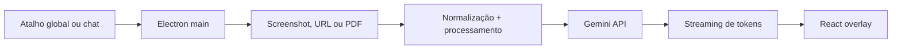
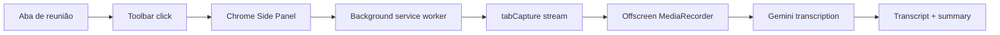

# Screen Copilot Suite

Screen Copilot Suite é um laboratório de copilotos contextuais com IA. A ideia central é simples: o assistente deve entender o que o usuário já está vendo, lendo ou ouvindo, sem depender de copy/paste manual o tempo todo.

O repositório hoje contém dois produtos experimentais:

- **ScreenMind**: aplicativo desktop em Electron que captura a tela, entende URLs/documentos e responde em uma conversa flutuante.
- **MindSide**: extensão Chrome com Side Panel que captura áudio de reuniões web, transcreve com Gemini e gera resumos.

> Projeto de portfólio construído com Electron, Chrome Extension MV3, React, TypeScript, IPC seguro, captura de mídia, Gemini multimodal APIs e UX de produto.


## Destaques

### ScreenMind Desktop

- Overlay flutuante com chat.
- Atalho global para abrir/capturar a tela.
- Captura da tela ativa com `desktopCapturer`.
- Perguntas sobre o screenshot mais recente.
- Respostas do Gemini em streaming.
- Entrada de URLs e PDFs diretamente no campo de conversa.
- Suporte a páginas web, PDFs hospedados, PDFs do GitHub e links públicos do Google Drive.
- Google Search opcional para preços, informações recentes e contexto web.
- Botão para copiar respostas.
- Modo conversa em tela cheia para continuar o chat com mais espaço.
- Botões de minimizar, fechar, fixar/desafixar e voltar ao modo compacto.
- Settings para chave Gemini, modelo, endpoint e qualidade de captura.
- Chave salva com `safeStorage` no Electron quando disponível.

### MindSide Chrome Extension

- Extensão Chrome Manifest V3.
- Side Panel nativo do Chrome.
- Detecção de abas de reunião: Google Meet, Microsoft Teams web e Zoom web.
- Captura explícita do áudio da aba de reunião via `chrome.tabCapture`.
- Documento offscreen com `MediaRecorder`.
- Chunks `audio/webm` enviados ao Gemini para transcrição.
- Feed de transcrição ao vivo.
- Resumo final em markdown ao parar a captura.
- Chave Gemini criptografada com Web Crypto antes de ir para `chrome.storage.local`.

## Casos De Uso

ScreenMind:

- Entender mensagens de erro na tela.
- Pedir ajuda com código visível.
- Resumir dashboards, páginas, PDFs e documentos online.
- Pedir review de um PDF ou link colado no chat.
- Buscar preço ou informação atual ativando Google Search.
- Continuar uma conversa em modo tela cheia sem perder o histórico.

MindSide:

- Acompanhar uma reunião web pelo Side Panel.
- Gerar transcrição em português.
- Transformar reunião em notas, decisões e próximos passos.
- Validar fluxo de captura de áudio em extensão Chrome MV3.

## Status Atual

O projeto já possui uma base funcional para demonstrações locais.

ScreenMind inclui:

- Shell desktop Electron.
- Renderer React + TypeScript.
- Preload com `contextBridge` em vez de expor `ipcRenderer`.
- Tray icon com ações principais.
- Captura e compressão de screenshots com Sharp.
- Gemini streaming API.
- Google Search grounding opcional.
- Fetch e normalização de documentos remotos.
- Fluxo especial para links `github.com/.../blob/...pdf`.
- Fluxo especial para links `drive.google.com/file/d/.../view`.
- Modo conversa expandido.

MindSide inclui:

- App da extensão em `apps/extension`.
- Build Vite + CRXJS.
- Side Panel em React.
- Background service worker.
- Offscreen document.
- Captura de áudio de aba.
- Transcrição e resumo com Gemini.

## Como Funciona

### ScreenMind

1. O processo principal do Electron registra o atalho global.
2. O usuário captura a tela ou cola uma URL/PDF no chat.
3. Screenshots são redimensionados e comprimidos com Sharp.
4. URLs são buscadas no processo principal e convertidas em texto ou anexos.
5. O renderer conversa com o main process por uma ponte IPC tipada.
6. O main process chama o Gemini e transmite os tokens de volta ao chat.



### MindSide

1. O usuário abre uma aba de reunião.
2. O usuário clica no ícone da extensão.
3. O Chrome abre o Side Panel.
4. O usuário inicia a captura.
5. O background worker cria um documento offscreen.
6. O offscreen document grava chunks de áudio.
7. O Gemini transcreve cada chunk.
8. Ao parar, o Gemini gera o resumo final.



## Stack

- Electron
- electron-vite
- React
- TypeScript
- Tailwind CSS
- Zustand
- Sharp
- Gemini API
- Electron Store
- Chrome Extensions MV3
- CRXJS
- Web Crypto
- IndexedDB

## Estrutura Do Projeto

```text
ScreenCopilot/
+-- apps/
|   +-- extension/              # MindSide Chrome extension
|       +-- src/
|       |   +-- background/      # Service worker + Gemini client
|       |   +-- offscreen/       # Audio recording document
|       |   +-- shared/          # Types, storage, meeting detection
|       |   +-- sidebar/         # Side Panel React UI
|       +-- manifest.config.ts
|       +-- package.json
+-- assets/
|   +-- icon.png
|   +-- icon.svg
+-- electron/
|   +-- documentFetcher.ts       # Remote URL/PDF fetching and normalization
|   +-- googleClient.ts          # Gemini streaming client
|   +-- main.ts                  # Window, tray, hotkey, IPC
|   +-- preload.ts               # Secure renderer bridge
|   +-- screenshot.ts            # Screen capture + image processing
+-- src/
|   +-- components/              # Desktop overlay UI
|   +-- hooks/                   # Chat and screenshot hooks
|   +-- store/                   # Zustand chat store
|   +-- App.tsx
|   +-- index.css
|   +-- main.tsx
|   +-- types.ts
+-- electron.vite.config.ts
+-- package.json
+-- README.md
```

## Requisitos

- Node.js 20+
- npm
- Google Gemini API key
- Chrome/Edge para testar a extensão MindSide

## Configuração Da API Key

Crie um arquivo `.env.local` na raiz para o app desktop:

```bash
cp .env.example .env.local
```

Preencha:

```text
SCREENMIND_GOOGLE_API_KEY=your_google_api_key_here
SCREENMIND_GOOGLE_MODEL=gemini-2.5-flash
```

No MindSide, a chave é configurada dentro do Side Panel da extensão.

## Rodando O ScreenMind Desktop

Instale dependências:

```bash
npm install
```

Rode em desenvolvimento:

```bash
npm run dev
```

Atalho global padrão:

```text
Ctrl+Shift+Space no Windows/Linux
Cmd+Shift+Space no macOS
```

## Build Do ScreenMind

```bash
npm run build
```

No Windows, o app fica em:

```text
release/win-unpacked/ScreenMind.exe
```

## Rodando O MindSide

```bash
cd apps/extension
npm install
npm run build
```

Carregue no Chrome:

1. Abra `chrome://extensions`.
2. Ative Developer Mode.
3. Clique em "Load unpacked".
4. Selecione `apps/extension/dist`.

Teste recomendado:

1. Abra uma aba do Google Meet, Teams web ou Zoom web.
2. Clique no ícone do MindSide na toolbar do Chrome.
3. Abra o Side Panel.
4. Clique em Start capture.
5. Fale ou reproduza áudio na reunião.
6. Aguarde chunks de transcrição.
7. Clique em Stop para gerar o resumo.

## Comandos Úteis

Raiz do projeto:

```bash
npm run dev
npm run typecheck
npm run build
```

MindSide:

```bash
cd apps/extension
npm run typecheck
npm run build
```

## Privacidade E Segurança

- ScreenMind envia prompts, screenshots e documentos para Gemini quando o usuário pede uma resposta.
- MindSide envia chunks de áudio e o transcript acumulado para Gemini.
- Chaves não são hardcoded no código.
- `.env.local` é ignorado pelo Git.
- No desktop, a chave pode ser salva com Electron `safeStorage`.
- Na extensão, a chave é criptografada com Web Crypto antes de ser armazenada.
- O preload usa `contextBridge` para expor uma API estreita ao renderer.
- A extensão exige ação explícita do usuário para capturar uma aba.

## Troubleshooting

### O botão novo não aparece no app

Atualize o código e reinicie o Electron:

```bash
git fetch origin
git checkout main
git pull origin main
npm install
npm run dev
```

Se estiver usando o app empacotado, rode `npm run build` novamente.

### URL do Google Drive não resume

O arquivo precisa estar acessível pelo link. Links públicos no formato abaixo são suportados:

```text
https://drive.google.com/file/d/<file-id>/view
```

Arquivos pequenos são baixados pelo app e enviados inline ao Gemini. Arquivos privados ou bloqueados pelo Drive podem falhar.

### PDF do GitHub não resume

Use o link normal do GitHub mesmo:

```text
https://github.com/owner/repo/blob/main/file.pdf
```

O app converte para `raw.githubusercontent.com` antes de chamar Gemini.

### Gemini retorna quota exceeded

Isso vem da conta/projeto da API key. Aguarde a janela de quota ou use uma chave/projeto com limite maior.

### MindSide não captura áudio

- Clique no ícone da extensão enquanto a aba da reunião está ativa.
- Não abra a captura a partir de `chrome://extensions` ou `chrome://newtab`.
- Confirme que a aba é Meet, Teams web ou Zoom web.
- Recarregue a extensão depois de cada build.

## License

MIT
