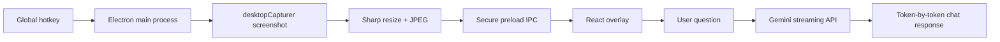

# ScreenMind / Screen Copilot

**ScreenMind** is a desktop AI copilot that sees your screen, captures the current visual context, and answers questions about what is visible without making you copy, paste, or describe the situation manually.

**ScreenMind** e um copiloto desktop com IA que enxerga sua tela, captura o contexto visual atual e responde perguntas sobre o que esta visivel sem que voce precise copiar, colar ou explicar tudo manualmente.

> Built as a portfolio project to demonstrate Electron, React, TypeScript, secure IPC, screenshot processing, streaming AI responses, and desktop UX.


## Demo Concept

Press a global shortcut, ask a question, and get a contextual answer based on the latest screen capture.

Example use cases:

- Ask what an error message on screen means.
- Ask for help understanding visible code.
- Ask for a quick summary of a dashboard, document, or webpage.
- Ask what action to take next based on the UI currently open.

## Current Status

This project already includes the core desktop foundation:

- Electron desktop shell with a floating overlay.
- React + TypeScript renderer.
- Global hotkey: `Ctrl+Shift+Space` on Windows/Linux and `Cmd+Shift+Space` on macOS.
- Screenshot capture using Electron `desktopCapturer`.
- Screenshot compression and resizing with Sharp.
- Secure `contextBridge` preload API instead of exposing `ipcRenderer`.
- Tray icon with actions to open the overlay, capture the screen, open settings, or quit.
- Gemini API integration with streaming responses.
- Inline image input for screen-aware questions.
- Settings panel for API key, model, endpoint, hotkey, and capture quality.
- Local development API key support through `.env.local`.
- Production build output for Windows as an unsigned unpacked app.

## How It Works

1. The Electron main process registers a global shortcut.
2. When the shortcut is pressed, ScreenMind captures the active display.
3. The screenshot is converted to JPEG, resized to a maximum width, and encoded as base64.
4. The renderer receives the capture through a narrow, typed IPC bridge.
5. The user asks a question in the overlay.
6. The main process sends the question plus the latest screenshot to Gemini.
7. The Gemini response streams back token by token into the chat UI.



## Tech Stack

- [Electron](https://www.electronjs.org/) for the desktop shell, tray, global shortcuts, and screen capture.
- [electron-vite](https://electron-vite.org/) for fast Electron + Vite development.
- [React](https://react.dev/) for the overlay UI.
- [TypeScript](https://www.typescriptlang.org/) across main, preload, and renderer code.
- [Tailwind CSS](https://tailwindcss.com/) for the interface.
- [Sharp](https://sharp.pixelplumbing.com/) for screenshot resizing and JPEG conversion.
- [Gemini API](https://ai.google.dev/) for multimodal AI responses.
- [electron-store](https://github.com/sindresorhus/electron-store) for local settings.

## Project Structure

```text
ScreenCopilot/
+-- electron/
|   +-- main.ts           # Electron app, overlay window, tray, hotkey, IPC
|   +-- preload.ts        # Secure bridge between main and renderer
|   +-- screenshot.ts     # Screen capture and Sharp image processing
|   +-- googleClient.ts   # Gemini streaming client
+-- src/
|   +-- App.tsx
|   +-- components/
|   |   +-- Overlay.tsx
|   |   +-- ChatBubble.tsx
|   |   +-- ScreenThumb.tsx
|   |   +-- ModeToggle.tsx
|   |   +-- SettingsPanel.tsx
|   +-- hooks/
|   |   +-- useChat.ts
|   |   +-- useScreenshot.ts
|   +-- store/
|   |   +-- chatStore.ts
|   +-- index.css
|   +-- main.tsx
|   +-- types.ts
+-- assets/
|   +-- icon.png
|   +-- icon.svg
+-- electron.vite.config.ts
+-- package.json
+-- README.md
```

## Privacy Notes

ScreenMind currently runs in cloud mode using Gemini. When you send a message, the current prompt and the latest captured screenshot can be sent to Google Gemini for analysis.

The app does **not** hardcode API keys in source code. For development, keys can be placed in `.env.local`, which is ignored by Git. In the app UI, keys are saved through Electron `safeStorage` when available.

Planned privacy improvements:

- Optional local/offline mode.
- Conversation retention controls.
- Clear visual indicator when an image will be sent to the model.

## Requirements

- Node.js 20+
- npm
- A Google Gemini API key

## Local Development

Install dependencies:

```bash
npm install
```

Create a local environment file:

```bash
cp .env.example .env.local
```

Then set:

```text
SCREENMIND_GOOGLE_API_KEY=your_google_api_key_here
SCREENMIND_GOOGLE_MODEL=gemini-2.5-flash
```

Run the app in development mode:

```bash
npm run dev
```

## Build

Run:

```bash
npm run build
```

On Windows, the current build target creates an unpacked app at:

```text
release/win-unpacked/ScreenMind.exe
```

This is useful for local testing and demos. A signed installer can be added later.

## Running On Startup

To keep ScreenMind available whenever Windows starts:

1. Run `npm run build`.
2. Press `Win + R`.
3. Type `shell:startup`.
4. Create a shortcut to:

```text
C:\Users\jpcic\Desktop\ScreenCopilot\release\win-unpacked\ScreenMind.exe
```

ScreenMind will then start with Windows and remain available in the system tray.

## Useful Commands

```bash
npm run dev
npm run typecheck
npm run build
```

## Roadmap

- Add a first-run onboarding flow.
- Add a toggle to start automatically with Windows.
- Persist chat history locally.
- Add screenshot retention controls.
- Add a polished demo GIF for the README.
- Add packaging for a proper Windows installer.
- Add optional offline model support.

## LinkedIn Post Angle

This project is a practical demo of a screen-aware AI assistant:

- Desktop app engineering with Electron.
- Secure process separation with preload IPC.
- Real-time screenshot capture and image optimization.
- Multimodal AI integration.
- Streaming AI UI.
- Product-focused UX for a small always-available overlay.

## License

MIT
