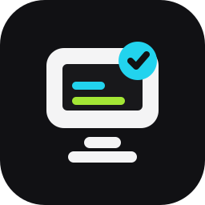
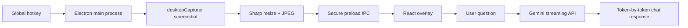

# Screen Copilot Suite

This repository contains two AI copilot experiments built around the same idea: context should come from what the user is already doing, not from manual copy/paste.

- **ScreenMind**: an Electron desktop app that sees the current screen and answers visual questions.
- **MindSide**: a Chrome Side Panel extension MVP that captures meeting-tab audio, transcribes it with Gemini, and generates a meeting summary.

**Screen Copilot Suite** e um projeto de portfolio com dois caminhos de produto: um app desktop que entende a tela inteira e uma extensao Chrome que testa a experiencia de copiloto em reunioes.

> Built to demonstrate Electron, Chrome Extensions MV3, React, TypeScript, secure IPC/message passing, media capture, Gemini multimodal APIs, and polished product UX.



## Demo Concepts

ScreenMind desktop:

- Press a global shortcut.
- Capture the current screen.
- Ask a question about what is visible.
- Get a streamed Gemini response.

MindSide meeting extension:

- Open a Google Meet, Microsoft Teams web, or Zoom web tab.
- Click the MindSide Chrome toolbar icon while the meeting tab is active.
- Start meeting capture.
- Watch transcript chunks appear.
- Stop and generate a markdown summary.

Example use cases:

- Ask what an error message on screen means.
- Ask for help understanding visible code.
- Ask for a quick summary of a dashboard, document, or webpage.
- Ask what action to take next based on the UI currently open.
- Capture meeting audio and turn it into notes, decisions, and action items.

## Current Status

This project already includes the core desktop foundation:

- Electron desktop shell with a floating overlay.
- React + TypeScript renderer.
- Global hotkey: `Ctrl+Shift+Space` on Windows/Linux and `Cmd+Shift+Space` on macOS.
- Screenshot capture using Electron `desktopCapturer`.
- Screenshot compression and resizing with Sharp.
- Secure `contextBridge` preload API instead of exposing `ipcRenderer`.
- Tray icon with actions to open the overlay, capture the screen, open settings, or quit.
- Gemini API integration with streaming responses.
- Inline image input for screen-aware questions.
- Settings panel for API key, model, endpoint, hotkey, and capture quality.
- Local development API key support through `.env.local`.
- Production build output for Windows as an unsigned unpacked app.

It also includes the first Chrome extension MVP:

- Manifest V3 Chrome extension in `apps/extension`.
- Native Chrome Side Panel UI.
- Meeting-tab detection for Google Meet, Teams web, and Zoom web.
- `chrome.tabCapture` audio capture coordinated by a background service worker.
- Offscreen document with `MediaRecorder` for 15-second `audio/webm` chunks.
- Gemini transcription and summary generation.
- Encrypted Google API key storage using Web Crypto + IndexedDB + `chrome.storage.local`.

## How It Works

### ScreenMind Desktop

1. The Electron main process registers a global shortcut.
2. When the shortcut is pressed, ScreenMind captures the active display.
3. The screenshot is converted to JPEG, resized to a maximum width, and encoded as base64.
4. The renderer receives the capture through a narrow, typed IPC bridge.
5. The user asks a question in the overlay.
6. The main process sends the question plus the latest screenshot to Gemini.
7. The Gemini response streams back token by token into the chat UI.



### MindSide Meeting Extension

1. The user clicks the extension action while the meeting tab is active.
2. The background service worker detects whether the active tab is a meeting.
3. The extension action opens a native Chrome Side Panel and records that Chrome has granted `activeTab` for the meeting tab.
4. The user explicitly starts capture.
5. The background worker creates an offscreen document and requests a tab audio stream ID.
6. The offscreen document records short audio chunks with `MediaRecorder`.
7. The background worker sends each audio chunk to Gemini for transcription.
8. The side panel displays transcript chunks and generates a summary after Stop.

```mermaid
flowchart LR
  A["Toolbar click on meeting tab"] --> B["Chrome side panel"]
  B --> C["Background service worker"]
  C --> D["tabCapture stream ID"]
  D --> E["Offscreen MediaRecorder"]
  E --> F["audio/webm chunks"]
  F --> G["Gemini transcription"]
  G --> H["Transcript feed"]
  H --> I["Final summary"]
```



## Tech Stack

- [Electron](https://www.electronjs.org/) for the desktop shell, tray, global shortcuts, and screen capture.
- [electron-vite](https://electron-vite.org/) for fast Electron + Vite development.
- [React](https://react.dev/) for the overlay UI.
- [TypeScript](https://www.typescriptlang.org/) across main, preload, and renderer code.
- [Tailwind CSS](https://tailwindcss.com/) for the interface.
- [Sharp](https://sharp.pixelplumbing.com/) for screenshot resizing and JPEG conversion.
- [Gemini API](https://ai.google.dev/) for multimodal AI responses.
- [electron-store](https://github.com/sindresorhus/electron-store) for local settings.
- [Chrome Extensions MV3](https://developer.chrome.com/docs/extensions/develop/migrate/what-is-mv3) for the browser extension.
- [CRXJS](https://crxjs.dev/vite-plugin) for Vite-powered extension builds.

## Project Structure

```text
ScreenCopilot/
+-- apps/
|   +-- extension/        # MindSide Chrome meeting MVP
+-- electron/
|   +-- main.ts           # Electron app, overlay window, tray, hotkey, IPC
|   +-- preload.ts        # Secure bridge between main and renderer
|   +-- screenshot.ts     # Screen capture and Sharp image processing
|   +-- googleClient.ts   # Gemini streaming client
+-- src/
|   +-- App.tsx
|   +-- components/
|   |   +-- Overlay.tsx
|   |   +-- ChatBubble.tsx
|   |   +-- ScreenThumb.tsx
|   |   +-- ModeToggle.tsx
|   |   +-- SettingsPanel.tsx
|   +-- hooks/
|   |   +-- useChat.ts
|   |   +-- useScreenshot.ts
|   +-- store/
|   |   +-- chatStore.ts
|   +-- index.css
|   +-- main.tsx
|   +-- types.ts
+-- assets/
|   +-- icon.png
|   +-- icon.svg
+-- electron.vite.config.ts
+-- package.json
+-- README.md
```

## Privacy Notes

ScreenMind currently runs in cloud mode using Gemini. When you send a message, the current prompt and the latest captured screenshot can be sent to Google Gemini for analysis.

MindSide currently sends short meeting audio chunks to Gemini for transcription and sends the accumulated transcript to Gemini for the final summary.

The project does **not** hardcode API keys in source code. For desktop development, keys can be placed in `.env.local`, which is ignored by Git. In the desktop app UI, keys are saved through Electron `safeStorage` when available. In the extension, keys are encrypted with Web Crypto before being stored in Chrome extension storage.

Planned privacy improvements:

- Optional local/offline mode.
- Conversation retention controls.
- Clear visual indicator when an image will be sent to the model.

## Requirements

- Node.js 20+
- npm
- A Google Gemini API key

## ScreenMind Desktop Development

Install dependencies:

```bash
npm install
```

Create a local environment file:

```bash
cp .env.example .env.local
```

Then set:

```text
SCREENMIND_GOOGLE_API_KEY=your_google_api_key_here
SCREENMIND_GOOGLE_MODEL=gemini-2.5-flash
```

Run the app in development mode:

```bash
npm run dev
```

## ScreenMind Desktop Build

Run:

```bash
npm run build
```

On Windows, the current build target creates an unpacked app at:

```text
release/win-unpacked/ScreenMind.exe
```

This is useful for local testing and demos. A signed installer can be added later.

## MindSide Extension Development

Install and build the extension:

```bash
cd apps/extension
npm install
npm run build
```

Load the extension in Chrome:

1. Open `chrome://extensions`.
2. Enable Developer Mode.
3. Click "Load unpacked".
4. Select `apps/extension/dist`.

To test capture, open a real meeting URL first, then click the MindSide toolbar icon while that meeting tab is active. Chrome only grants `tabCapture` for tabs where the extension was invoked. Starting from a side panel that was opened from `chrome://extensions`, `chrome://newtab`, or another browser page will fail because Chrome pages cannot be captured.

Useful extension commands:

```bash
cd apps/extension
npm run typecheck
npm run build
```

## Running On Startup

To keep ScreenMind available whenever Windows starts:

1. Run `npm run build`.
2. Press `Win + R`.
3. Type `shell:startup`.
4. Create a shortcut to:

```text
C:\Users\jpcic\Desktop\ScreenCopilot\release\win-unpacked\ScreenMind.exe
```

ScreenMind will then start with Windows and remain available in the system tray.

## Useful Commands

```bash
npm run dev
npm run typecheck
npm run build
```

## Roadmap

- Add a first-run onboarding flow.
- Add a toggle to start automatically with Windows.
- Persist chat history locally.
- Add screenshot retention controls.
- Add a polished demo GIF for the README.
- Add packaging for a proper Windows installer.
- Add optional offline model support.
- Manually validate MindSide on Google Meet.
- Add speaker detection and live action-item extraction to MindSide.
- Add document and screen modes to MindSide after the meeting MVP is stable.

## LinkedIn Post Angle

This project is a practical demo of a screen-aware AI assistant:

- Desktop app engineering with Electron.
- Secure process separation with preload IPC.
- Real-time screenshot capture and image optimization.
- Multimodal AI integration.
- Streaming AI UI.
- Product-focused UX for a small always-available overlay.
- Chrome extension engineering with Manifest V3, side panels, tab audio capture, and offscreen documents.

## License

MIT
